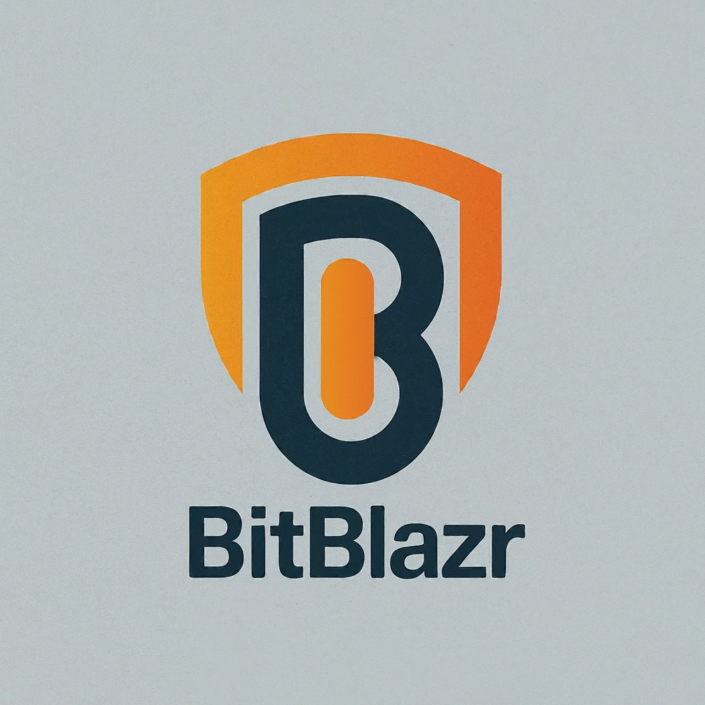

<p align="left">
  
</p>

[](https://github.com/auseckas/bitblazr/actions/workflows/rust.yml)
[](https://discord.gg/xHW2cb2N6G)

**BitBlazr** harnesses the power of eBPF to fortify IoT and container environments against potential threats. Blending features from Mandatory Access Controls (MAC) and eBPF-based monitoring programs, the sensor offers a kernel-level rule system for policy enforcement as well as configurable logging targets, empowering users with robust filtering logic and clear delineation between events, alerts, and informational messages.

Its primary objective is to detect initial intrusions and thwart the various pivot steps typically undertaken by malicious actors post-infiltration.

**BitBlazr** boasts a lightweight and secure architecture, rendering it more streamlined and deployable compared to traditional agents. By plugging directly into the kernel via eBPF, it optimizes resource utilization, circumventing the need for excessive context switches between user and kernel space. During testing on Arm64 IoT systems, it exhibited minimal CPU consumption, consuming less than 5% of a single core.

Furthermore, the sensor’s eBPF programs undergo rigorous scrutiny by the kernel's verifier function, ensuring bulletproof integrity and safeguarding against potential system compromise. This verification process enforces stringent safety measures, mitigating the risk of malicious or faulty code wreaking havoc on system stability or security.

Key features of the BitBlazr sensor include:

1. Kernel-Level Rule Engine: Enforced via LSM, facilitating granular control over security policies.
2. Robust Logging Rules: Empower users to segregate monitoring events from potential security alerts and fine-tune filtering logic to mitigate false positives.
3. Contextual Security: Leveraging process labels to contextualize security enforcement, distinguishing between benign activities and potentially malicious behavior. For instance, while executing the "ls" command within a container may not raise suspicion, launching any shell commands from a web server thread could signal a nefarious intrusion attempt, triggering appropriate security measures.
4. Send events up to the cloud - HiveMQ integration is included in the open-source version.

The sensor has been tested on x86_64 and Aarch64 (Arm64) architectures, on Linux kernel 6.0 and above.

:warning:
The project is currently in "beta" - use at your own risk.

<hr>

# Installation

## Prerequisites

1. Install bpf-linker: `cargo install bpf-linker`

## Build eBPF

```bash
cargo xtask build-ebpf
```

To perform a release build you can use the `--release` flag.
You may also change the target architecture with the `--target` flag.

## Build Userspace

```bash
cargo build
```

## Run

```bash
RUST_LOG=info cargo xtask run
```
